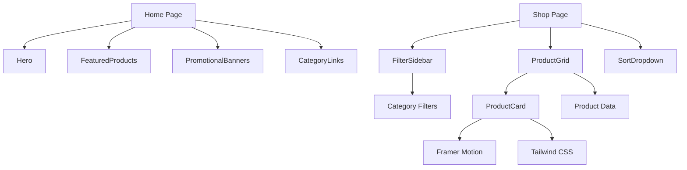
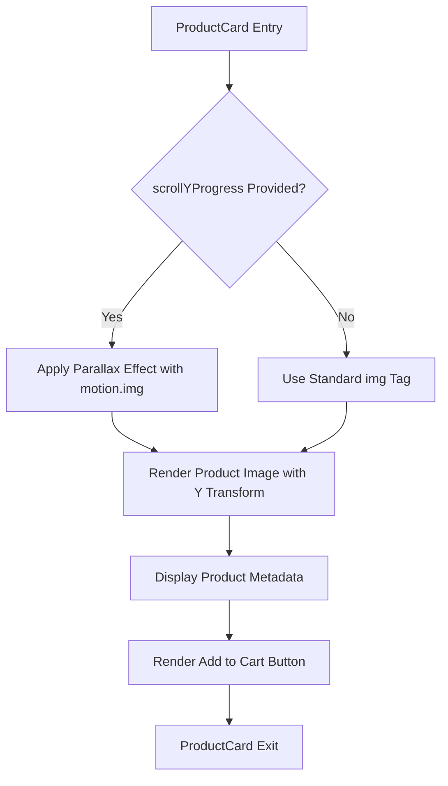
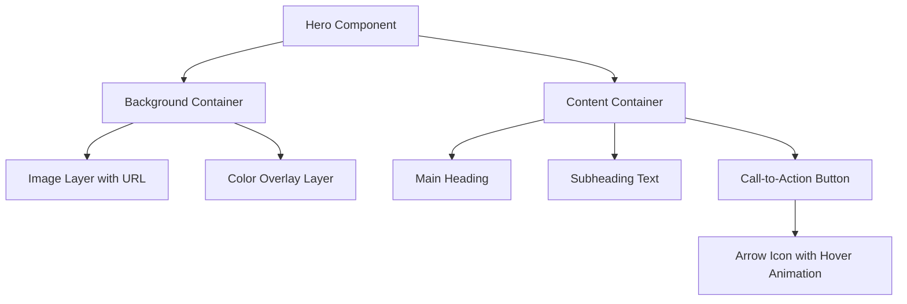
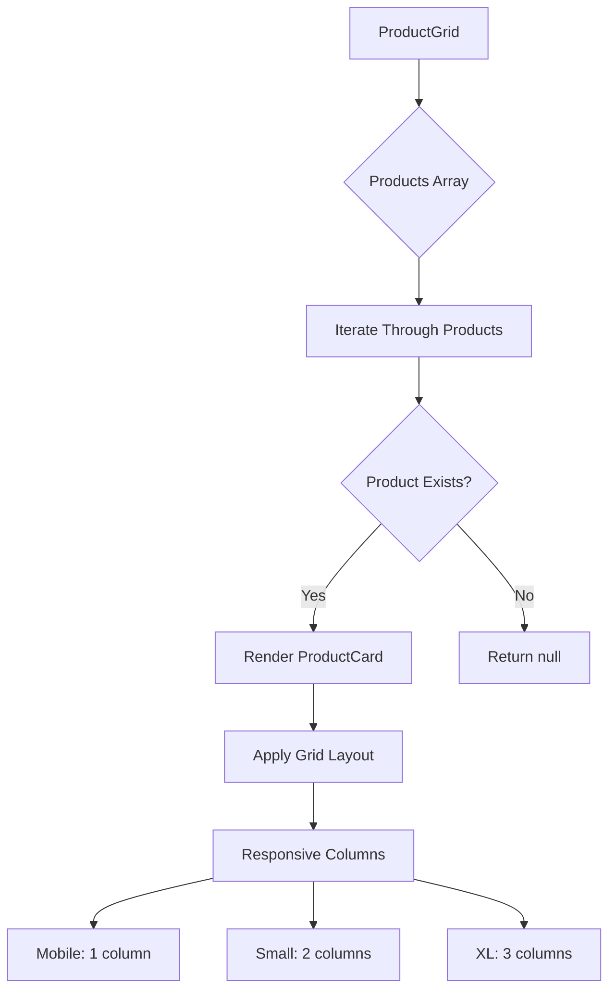
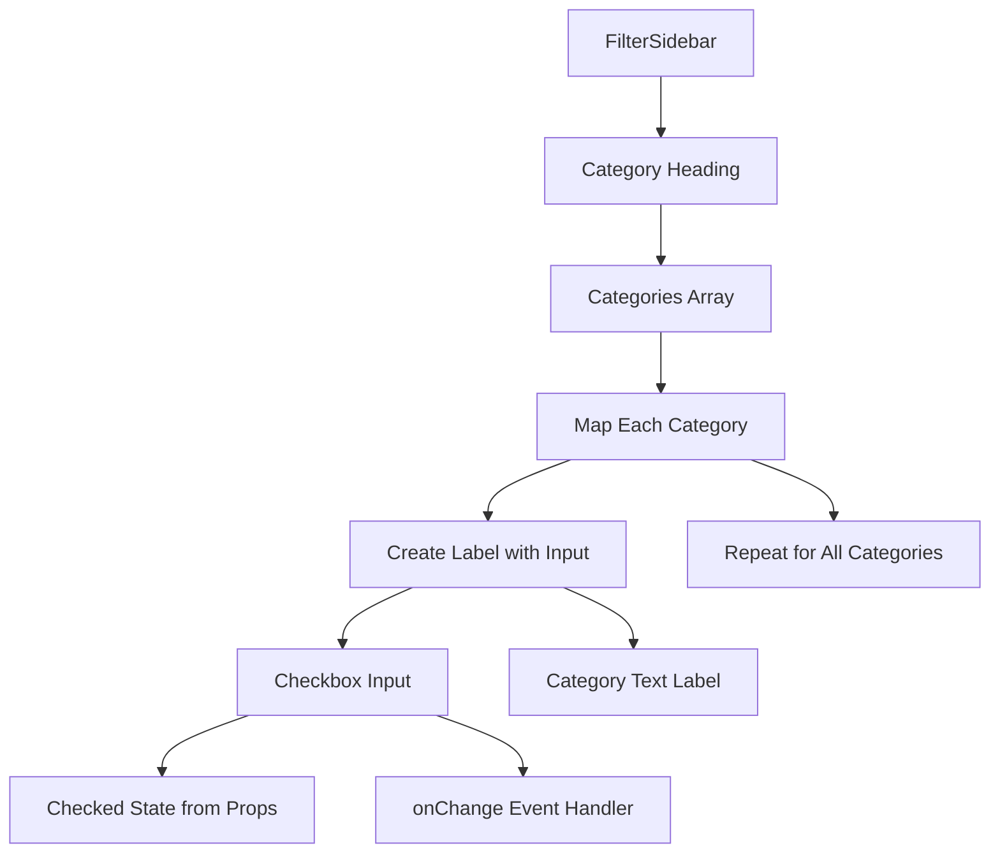
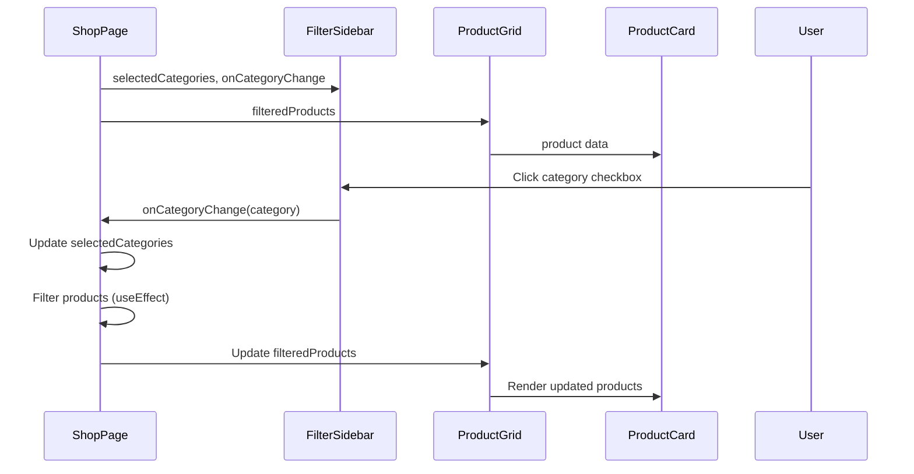

# UI Components

<cite>
**Referenced Files in This Document**   
- [ProductCard.js](file://client/app/components/shared/ProductCard.js)
- [Hero.js](file://client/app/components/Home/Hero.js)
- [ProductGrid.js](file://client/app/components/Shop/ProductGrid.js)
- [FilterSidebar.js](file://client/app/components/Shop/FilterSidebar.js)
- [page.js](file://client/app/page.js)
- [shop/page.js](file://client/app/shop/page.js)
</cite>

## Table of Contents
1. [Introduction](#introduction)
2. [Core Components Overview](#core-components-overview)
3. [ProductCard Component](#productcard-component)
4. [Hero Component](#hero-component)
5. [ProductGrid Component](#productgrid-component)
6. [FilterSidebar Component](#filtersidebar-component)
7. [Component Integration and Data Flow](#component-integration-and-data-flow)
8. [Styling and Theme Customization](#styling-and-theme-customization)
9. [Accessibility Features](#accessibility-features)
10. [Performance Considerations](#performance-considerations)

## Introduction
This document provides comprehensive documentation for the key UI components in the VnV24 frontend application. The focus is on reusable components such as ProductCard, Hero, ProductGrid, and FilterSidebar, detailing their implementation, props, events, and customization options. The documentation covers interactive features including hover effects, animations using Framer Motion, and responsive design patterns. It also explains integration with backend data sources, accessibility features, styling approach using Tailwind CSS, and performance optimization strategies.

## Core Components Overview
The VnV24 frontend application utilizes a component-based architecture with reusable UI elements organized in a structured directory system. The core components are divided into functional categories: Home components for the landing page, Shop components for product browsing, and shared components used across multiple pages. These components leverage React's component model, Next.js client-side functionality, and modern CSS frameworks to deliver an engaging user experience.

**Diagram sources**
- [page.js](file://client/app/page.js#L1-L17)
- [shop/page.js](file://client/app/shop/page.js#L1-L72)

**Section sources**
- [page.js](file://client/app/page.js#L1-L17)
- [shop/page.js](file://client/app/shop/page.js#L1-L72)

## ProductCard Component

The ProductCard component is a reusable UI element that displays product information in a visually appealing card format. It serves as the building block for product listings throughout the application.

### Props
- `product`: Object containing product data (id, name, category, price, imageUrl)
- `scrollYProgress`: Optional scroll progress value from Framer Motion for parallax effects

### Features
- **Interactive Hover Effects**: Implements smooth scale transformation on hover using Tailwind's group-hover utilities
- **Parallax Animation**: When scrollYProgress is provided, applies vertical parallax effect to product images using Framer Motion
- **Currency Formatting**: Automatically formats prices in Indian Rupees (INR) with proper localization
- **Responsive Design**: Maintains aspect ratio with Tailwind's aspect-square utility and adapts layout across breakpoints

### Accessibility
- Proper alt text for product images
- Semantic HTML structure with appropriate heading levels
- Keyboard navigable through Link wrapper
- Sufficient color contrast for text elements

**Diagram sources**
- [ProductCard.js](file://client/app/components/shared/ProductCard.js#L5-L40)

**Section sources**
- [ProductCard.js](file://client/app/components/shared/ProductCard.js#L5-L40)

## Hero Component

The Hero component creates a visually striking introduction section for the homepage, featuring a full-width banner with overlay text and call-to-action.

### Features
- **Background Image with Overlay**: Uses absolute positioning to create a layered effect with a semi-transparent green overlay
- **Responsive Typography**: Text scales appropriately from mobile to desktop with md:text-* classes
- **Animated Call-to-Action**: Button features hover translation animation on the arrow icon using CSS transforms
- **Fixed Height Layout**: Maintains consistent 600px height across viewports

### Styling Approach
- Utilizes Tailwind's font-serif for elegant typography
- Implements z-index system for proper layering of background and foreground elements
- Uses opacity utilities for the color overlay effect
- Applies hover effects with smooth transitions

### Accessibility
- High contrast between text and background
- Proper heading hierarchy with h1 for main title
- Focusable button with clear call-to-action text
- Responsive padding for touch targets

**Diagram sources**
- [Hero.js](file://client/app/components/Home/Hero.js#L4-L31)

**Section sources**
- [Hero.js](file://client/app/components/Home/Hero.js#L4-L31)

## ProductGrid Component

The ProductGrid component organizes multiple ProductCard components in a responsive grid layout, adapting to different screen sizes.

### Props
- `products`: Array of product objects to be displayed

### Responsive Layout
- **Mobile**: Single column layout (grid-cols-1)
- **Small screens**: Two-column layout (sm:grid-cols-2)
- **Extra large screens**: Three-column layout (xl:grid-cols-3)
- Consistent 2rem gap between grid items (gap-8)

### Implementation Details
- Maps over the products array to render individual ProductCard components
- Uses product ID as key when available, falls back to array index
- Filters out null products to prevent rendering errors
- Implements proper spacing with Tailwind's margin utilities

### Performance Considerations
- Efficient rendering through React's reconciliation process
- Minimal re-renders when product data changes
- Proper key usage for optimal list rendering performance

**Diagram sources**
- [ProductGrid.js](file://client/app/components/Shop/ProductGrid.js#L2-L15)

**Section sources**
- [ProductGrid.js](file://client/app/components/Shop/ProductGrid.js#L2-L15)

## FilterSidebar Component

The FilterSidebar component provides category filtering functionality for the shop page, allowing users to refine product listings.

### Props
- `selectedCategories`: Array of currently selected category names
- `onCategoryChange`: Callback function triggered when a category checkbox is toggled

### Features
- **Category Filtering**: Displays checkboxes for four product categories (Perfumes, Oils, Candles, Incense)
- **Controlled Components**: Checkbox state is controlled through props and callback
- **Visual Feedback**: Gold-colored checkboxes with focus ring for accessibility
- **Responsive Layout**: Occupies one column in large grid layouts (lg:col-span-1)

### Styling
- Uses forest-green for headings to maintain brand consistency
- Implements proper spacing with space-y-3 utility
- Applies rounded corners and border with consistent color scheme
- Uses cursor-pointer to indicate interactive elements

### Accessibility
- Label elements properly associated with input checkboxes
- Sufficient touch target size for mobile users
- Visual feedback for focus states
- Clear text labels for screen readers

**Diagram sources**
- [FilterSidebar.js](file://client/app/components/Shop/FilterSidebar.js#L1-L20)

**Section sources**
- [FilterSidebar.js](file://client/app/components/Shop/FilterSidebar.js#L1-L20)

## Component Integration and Data Flow

The components work together to create a cohesive shopping experience, with data flowing from parent to child components through props.

### Data Flow Pattern
- **Shop Page**: Manages application state (selectedCategories, sortOrder, filteredProducts)
- **State Management**: Uses useState and useEffect hooks for reactivity
- **Prop Drilling**: Passes state and callbacks down to child components
- **Event Handling**: Child components trigger parent state updates through callback functions

### Integration Example
The FilterSidebar receives selected categories and a callback function from the ShopPage. When a user interacts with a checkbox, the callback updates the parent state, which triggers a re-filtering of products in the useEffect hook. The filtered results are then passed to ProductGrid, which renders the appropriate ProductCard components.

**Diagram sources**
- [shop/page.js](file://client/app/shop/page.js#L1-L72)
- [FilterSidebar.js](file://client/app/components/Shop/FilterSidebar.js#L1-L20)
- [ProductGrid.js](file://client/app/components/Shop/ProductGrid.js#L2-L15)

**Section sources**
- [shop/page.js](file://client/app/shop/page.js#L1-L72)

## Styling and Theme Customization

The application uses Tailwind CSS for styling with a consistent theme defined through custom color variables.

### Color Palette
- **Primary**: Background color for main content areas
- **Secondary**: Background for sidebar and secondary elements
- **Forest Green**: Primary text and heading color for brand identity
- **Gold**: Accent color for buttons and interactive elements
- **Text Colors**: Different shades for primary, secondary, and dark text
- **Border Color**: Consistent border color for card elements

### Typography
- **Font Families**: Serif font for headings, system font for body text
- **Responsive Text**: Multiple heading sizes that scale with viewport
- **Font Weights**: Bold for emphasis, medium for secondary text

### Spacing and Layout
- Consistent spacing system using Tailwind's spacing scale
- Responsive grid layouts that adapt to screen size
- Proper padding and margin for visual hierarchy
- Aspect ratio utilities for consistent image display

### Theme Customization
The theme can be customized by modifying the Tailwind configuration file (tailwind.config.js) to change color values, font families, or spacing scales. Components will automatically reflect these changes due to the utility-first CSS approach.

**Section sources**
- [globals.css](file://client/app/globals.css)
- [tailwind.config.js](file://client/tailwind.config.js)

## Accessibility Features

The components implement several accessibility features to ensure usability for all users.

### Keyboard Navigation
- All interactive elements are focusable
- Logical tab order through the page
- Visual focus indicators on buttons and links
- Accessible form controls in FilterSidebar

### Screen Reader Support
- Proper semantic HTML structure
- Descriptive alt text for all images
- ARIA labels where appropriate
- Meaningful link text ("Explore Collection" rather than "Click here")

### Color and Contrast
- Sufficient contrast between text and background colors
- Color is not the only means of conveying information
- Visual feedback for interactive states
- Consistent styling for similar elements

### Responsive Design
- Touch-friendly tap targets (minimum 44px)
- Appropriate spacing between interactive elements
- Content reflows appropriately on small screens
- No horizontal scrolling required

**Section sources**
- [ProductCard.js](file://client/app/components/shared/ProductCard.js#L5-L40)
- [Hero.js](file://client/app/components/Home/Hero.js#L4-L31)
- [FilterSidebar.js](file://client/app/components/Shop/FilterSidebar.js#L1-L20)

## Performance Considerations

The components are designed with performance optimization in mind.

### Rendering Optimization
- Efficient use of React's reconciliation algorithm
- Proper key usage in lists to minimize re-renders
- Conditional rendering to avoid unnecessary DOM elements
- Memoization opportunities for expensive calculations

### Image Loading
- Placeholder images with consistent aspect ratios
- Consider implementing lazy loading for product images
- Optimize image sizes and formats in production
- Use next/image component for automatic optimization

### Animation Performance
- CSS transitions for hover effects (hardware accelerated)
- Framer Motion for complex animations with performance optimizations
- Debounced or throttled event handlers for scroll-based effects
- Will-change property for elements that will be animated

### Bundle Size
- Tree-shaking to eliminate unused code
- Code splitting through Next.js routing
- Lazy loading of non-critical components
- Minification and compression in production build

**Section sources**
- [ProductCard.js](file://client/app/components/shared/ProductCard.js#L5-L40)
- [shop/page.js](file://client/app/shop/page.js#L1-L72)
- [ProductGrid.js](file://client/app/components/Shop/ProductGrid.js#L2-L15)